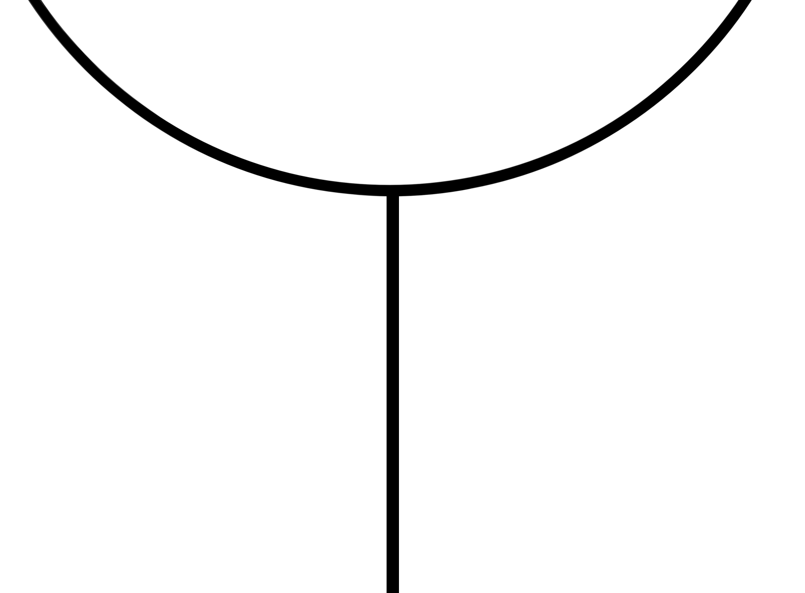
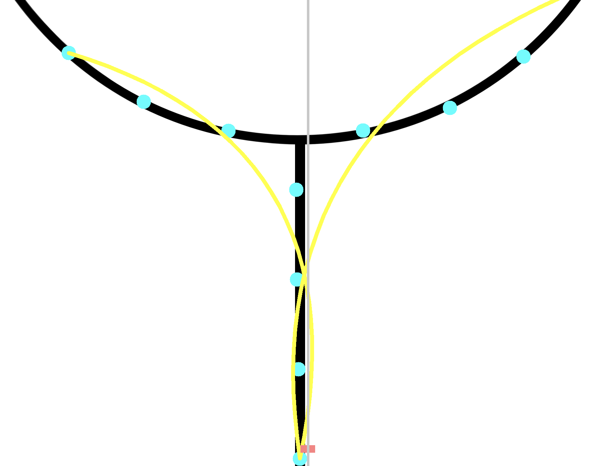
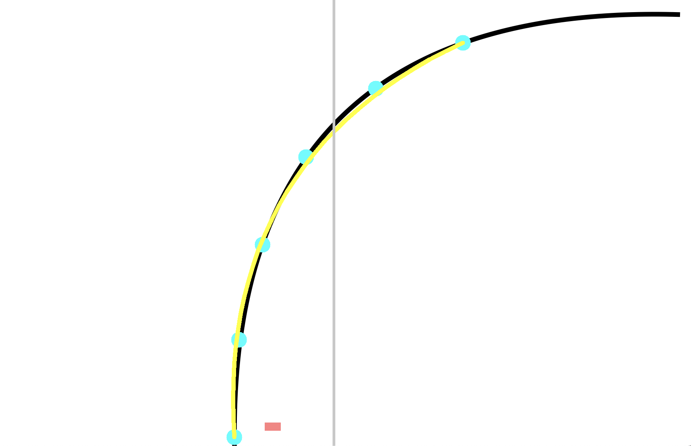

# 🚗 cumtb_racecar_quickstart

**中国矿业大学（北京）智能车校赛视觉方案 · 快速上手参考**

本仓库提供一个轻量级视觉处理示例，可用于智能车校赛视觉算法的调试、图像预处理与线检测等任务。基于 Python + OpenCV + Scikit-learn，适合快速实验与算法验证。

---

## 📦 环境配置

### 1. 创建 Conda 环境（可选）

```bash
conda create -n vision python=3.12
conda activate vision
```

### 2. 安装依赖

```bash
pip install scikit-learn
pip install opencv-python
```

---

## 🏁 如何运行

### 编辑脚本中的图片路径

打开 `extract.py`，找到：

```python
img = "your_image_path_here"
```

替换为你的输入图像路径。

### 然后运行：

```bash
python extract.py
```

---

## 📸 图像处理示例

下方展示基于该代码的输入与输出结果。

### 🔹 输入图像

| 输入一                           | 输入二                           |
| ----------------------------- | ----------------------------- |
|  |  |

### 🔹 处理后输出

| 输出一                             | 输出二                             |
| ------------------------------- | ------------------------------- |
|  |  |

---


## 🔧 算法原理与流程

本视觉算法通过 “赛道像素提取 → 路径生长 → 曲线拟合 → 控制输出” 的方式，实现智能车的赛道追踪。

---

### **步骤一：赛道提取（二值化处理）**

🔹 输入图像 → 灰度化（Grayscale）

🔹 通过阈值分割提取黑色赛道区域（Binary Threshold）

🔹 得到：黑色 = 赛道 / 白色 = 背景

（可用 OpenCV：`cv2.cvtColor` + `cv2.threshold`）

---

### **步骤二：赛道起点聚类（底部扫描）**

🔹 在图像底部连续取 *n* 层像素，形成一个矩形扫描区域

🔹 使用聚类（K-Means 或连通域提取）将黑色像素团聚合成一块

🔹 提取这块区域的中心 → 作为赛道路径起点


---

### **步骤三：BFS 扩展（多路径搜索）**

对每一个路径点执行：

1. 以该点为圆心，在 θ = 0° 到 180° 范围扫描
2. 扫描半径 = dis（距离参数）
3. 若扫描区域内发现黑色像素 → 进行聚类（圈定赛道点）
4. 若找到多个新点 → 路径分裂（多分支追踪）
5. 将新点 push 进路径列表
6. 重复此过程，直到路径长度 > threshold

这个过程相当于：

> 自底向上追踪赛道骨架，能容忍分叉，支持多路线同时探索。

---

### **步骤四：贝塞尔拟合（平滑路径）**

🔹 对全部路径点进行曲线拟合

🔹 使用二次 / 三次贝塞尔曲线平滑轨迹

🔹 从拟合曲线中重新采样 k 个点

🔹 从下到上，点权重逐渐减小

```
target = Σ (贝塞尔点[i] * weight[i])
```

得到最终目标点 target，用于引导车辆。

---

### **步骤五：控制误差计算**

```
error = target − 图像中心
```

该误差可直接输出给：

* PID 控制器
* 方向/速度调节模块

最终实现自动循迹控制。

---

## 📂 文件结构

```
cumtb_racecar_quickstart/
│
├── extract.py
├── photo/
│   ├── in1.png
│   ├── in2.png
│   ├── out1.png
│   ├── out2.png
│
└── README.md
```


## 📝 校赛加油呀

